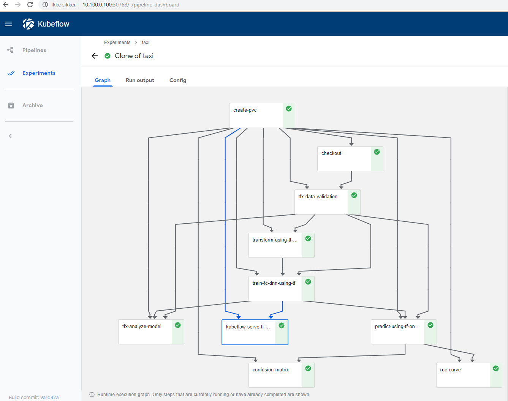

# Kubeflow onprem using Microk8s

Installing Kubeflow onprem took a couple of iterations, so to my self and others that might come across this, I write down the steps I used to install Kubeflow and run the [TFX Taxi Cab Pipeline](https://github.com/kubeflow/pipelines/tree/master/samples/tfx)

The starting point is the official [installation guide](https://www.kubeflow.org/docs/started/getting-started-multipass)

If you find this tutorial and Kubeflow 0.5.2 is out, try just following the standard installation tutorial, however for 0.5.1 these tweaks listed below was needed for me to get it running

## 1. Install Microk8s

Follow the instructions on https://www.kubeflow.org/docs/started/getting-started-multipass/
I only made this work with 1.13/stable so you need to change the version in setup-microk8s.sh to follow this installation guide
also make sure you have docker installed

```
# from https://www.coveros.com/installing-microk8s-114-for-local-development/
sudo apt update
sudo apt install snapd
sudo apt-get install docker.io
```

NOTE: Sometimes the installation script fails in setting up the dashboard, if that is the case you can run the commands manually
```
microk8s.enable dns dashboard storage
iptables -P FORWARD ACCEPT
```
## 2. Install Kubeflow
Installing Kubeflow should be as simple as just running these commands
```
git clone https://github.com/canonical-labs/kubeflow-tools
cd kubeflow-tools
./install-kubeflow.sh
```
But to get on prem Persistent Volume (PV) Provisioning working we need argo version 2.3 so we will change the install script slightly by commenting out the last steps and running them manually

```
# comment out these steps in install-kubeflow.sh
# apply_kubeflow
# wait_for_kubeflow
# . "${SCRIPTS_DIR}/print_ports.sh"
```
Now we can run the install script
```
cd kubeflow-tools
./install-kubeflow.sh
```
Now you have a new dir called mykubeflow, here we need to edit the argo version to 2.3
```
sudo vi mykubeflow/ks_app/components/params.libsonnet
sudo vi mykubeflow/ks_app/vendor/kubeflow/argo/prototypes/argo.jsonnet
```

We now have the installation dir ready, so either uncomment the steps in the install script or simply run the apply command
```
cd mykubeflow
sudo /home/some_one/kubeflow/0.5.1/scripts/kfctl.sh apply k8s
# Wait for Kubeflow to be installed, you can go to the Kubernetes dashboard and wait for all pods to be up
cd ..
kubeflow-tools/print_ports.sh
```
## 3. Run one of the sample experiments
Login to Kubeflow and run one of the sample experiments, if you don’t know how you can have a look at [this] (https://codelabs.developers.google.com/codelabs/cloud-kubeflow-pipelines-gis/index.html?index=../..index#3) but instead of uploading an experiment just take of the samples

For me the run failed and i had to do the fix mentioned in [kubeflow issue 2347](https://github.com/kubeflow/kubeflow/issues/2347)
if /var/lib/docker or /var/run/docker.sock is already there, rename so you have a backup
```
sudo ln -s /var/snap/microk8s/common/var/lib/docker /var/lib/docker
sudo ln -s /var/snap/microk8s/current/docker.sock /var/run/docker.sock
```

## 4. Run the provissioning example
Make sure that Argo is set up correctly and can allocate storage we can run the [volumeop_basic example] (https://github.com/kubeflow/pipelines/blob/master/samples/resourceops/volumeop_basic.py)

To do this we need to check out the pipeline repo, install the pipeline pip package, and compile the example

you can find the newest release of the pipeline [here](https://github.com/kubeflow/pipelines/releases)

```
git clone https://github.com/kubeflow/pipelines.git
pip3 install https://storage.googleapis.com/ml-pipeline/release/0.1.21/kfp.tar.gz --upgrade
cd pipeline/samples/resourceops
python volumeop_basic.py volumeop_basic.tar.gz
```
Go to the Kubeflow UI and upload the pipeline, and start a new experiment with the pipeline

At first the experiment failed at step 2, and I needed to update the pipeline version for kubeflow
upgrede instrunctions are found [here] (https://www.kubeflow.org/docs/pipelines/upgrade/)

go to /mykubeflow/ks_app and run
```
/home/the/kubeflow/0.5.0/scripts/upgrade_kfp.sh 336eeb6637b38ae474f00657c4e9b9550397e03d
```
The commit hash you can find on the [kubeflow pipeline release page] (https://github.com/kubeflow/pipelines/releases)

Try to run the experiment again and it should work

## 5. Run the tfx taxicab example
The system should now be setup and it should be possible to run the taxicab example

we need to compile the pipeline, upload it and run. so navigate your prompt to the pipeline project
```
cd /pipeline/samples/tfx
sed -i.sedbak s"/platform = 'GCP'/platform = 'onprem'/"  taxi-cab-classification-pipeline.py
python taxi-cab-classification-pipeline.py taxi-cab-classification-pipeline.tar.gz
```
When running the experiment follow the instructions in the example readme

And that should be it, after some time you should see this


